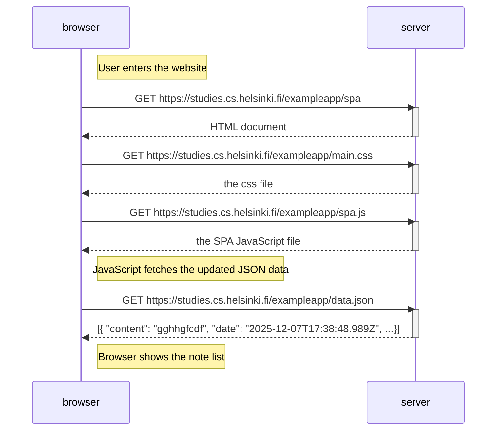

```mermaid
sequenceDiagram
    participant browser
    participant server

    Note right of browser: User enters the website
    
    browser->>server: GET https://studies.cs.helsinki.fi/exampleapp/spa
    activate server
    server-->>browser: HTML document
    deactivate server

    browser->>server: GET https://studies.cs.helsinki.fi/exampleapp/main.css
    activate server
    server-->>browser: the css file
    deactivate server
    
    browser->>server: GET https://studies.cs.helsinki.fi/exampleapp/spa.js
    activate server
    server-->>browser: the SPA JavaScript file
    deactivate server

    Note right of browser: JavaScript fetches the updated JSON data
    
    browser->>server: GET https://studies.cs.helsinki.fi/exampleapp/data.json
    activate server
    server-->>browser: [{ "content": "gghhgfcdf", "date": "2025-12-07T17:38:48.989Z", ...}]
    deactivate server

    Note right of browser: Browser shows the note list
```
