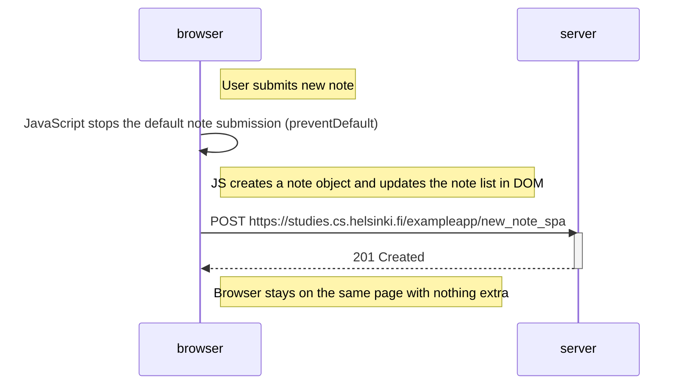

```mermaid
sequenceDiagram
    participant browser
    participant server

    Note right of browser: User submits new note
    
    browser->>browser: JavaScript stops the default note submission (preventDefault)

    Note right of browser: JS creates a note object and updates the note list in DOM

    browser->>server: POST https://studies.cs.helsinki.fi/exampleapp/new_note_spa
    activate server
    server-->>browser: 201 Created
    deactivate server

    Note right of browser: Browser stays on the same page with nothing extra
```
